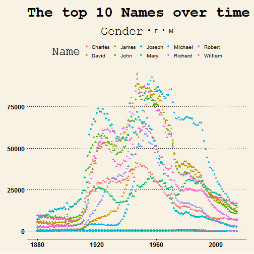

## US Baby Names

If you've ever had a child, or just wondered how common your name was, this [product](https://platothewise.shinyapps.io/shinyapp/) may be of interest to you.  You can view the most popular names for a selected period in US history.  You can even search for a specific name, and see how common it is over time.

---

## Selection Filters

Select a range of dates and pick the number of popular names to display.  The names are ordered from most to least popular during that time-period.  Male names are colored blue and female names are pink .

---

## Most Popular Names and a Timeline
Select `Popular Names` and see a word cloud (by gender) of the most popular names for that time-period.  You can also select `Timeline`, enter a name, and see the popularity of that name over time.

 

 

---

### More to Explore

There is a lot more to [discover] (https://www.kaggle.com/kaggle/us-baby-names).  For example, some R code run during this `Slidify` presentation suggest there has been a shift away from traditional names since the 1950's.

---

*** =image

---

*** =image

---

*** =image

---  &checkbox

## Multi Text

*** =image

--- .segue bg:grey

